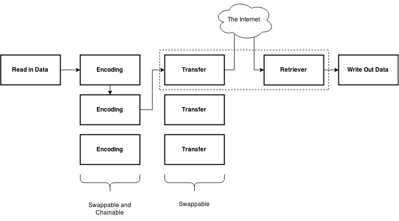

# sneaky-creeper
Using social media as a tool for data exfiltration.

Usage
=====

sneaky-creeper has two base elements: **encoders** (the left column in the diagram above, they encode/decode data) and **channels** (the part that actually does Internet things, in the dotted rectangle in the diagram above). You can chain encoders to, say, base64 encode your data, then encrypt it with RSA, but there can only be one channel in each command. `-e` specifies encoders (specify as many as you want), and `-c` specifies channels.

To see what channels are available:

`./screep channels`

To see what encoders are available:

`./screep encoders`

To write some data to a file in plaintext:

`echo "some data" | ./screep send -e identity -c file -p '{"file": {"filename", "test.txt"}}'`

See how useful that is?

To read the file back in:

`./screep receive -e identity -c file -p '{"file": {"filename", "test.txt"}}'`

To do the same, but encrypt the file's contents with RSA:

`echo "some data" | ./screep send -e rsa -c file -p '{"file": {"filename", "test.txt"}, "rsa": {"publicKey": "rsakey.pem.pub"}}'  `  
`./screep receive -e rsa -c file -p '{"file": {"filename", "test.txt"}, "rsa": {"privateKey": "rsakey.pem"}}' privateKey`

To just test out the base64 encoder:

`echo "some data" | ./screep echo -e b64`

If you specify multiple encoders, the order is automatically reversed on decode so that you can specify them in the same order on both sides of the transmission and everything will work.

Setup
=====

#### Dependencies:

`sudo pip install pycrypto twython soundcloud`

#### API Keys:

#####Twitter:

Instructions are here: http://twython.readthedocs.org/en/latest/usage/starting_out.html

When the instructions are complete, go to the Twitter API page

Examine your access level for Consumer Key and Access Key and be sure they are set to read and write.

1. If not set to read and write, change the Consumer Key settings to be read and write
2. Revoke the Access Token
3. Wait five minutes
4. Generate a new access token

It should now mimic the access level of the Consumer Key

#####Tumblr:

Make a Tumblr account and [create an app](https://www.tumblr.com/oauth/apps). Then, visit the [API console](https://api.tumblr.com/console/calls/user/info) and note down the four strings there; these are your `key`, `secret`, `token`, and `token_secret`.

#####Soundcloud:

Make a Soundcloud account and [register and app](https://developers.soundcloud.com/docs/api/guide). Visist your [apps console](https://soundcloud.com/you/apps/) and note the strings for Client ID and for the Client Secret. These are for the `ID` and `secret`, while your username and password are for the `username` and `password`.
